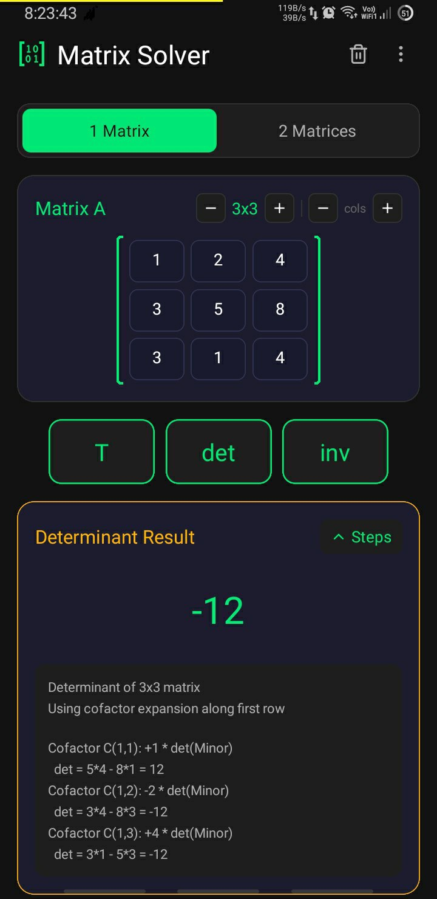
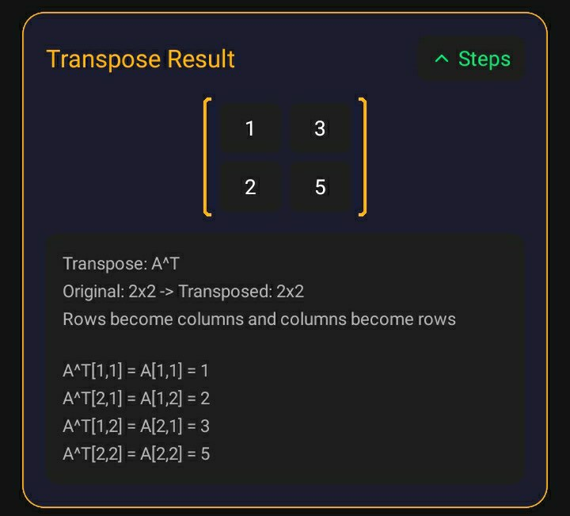
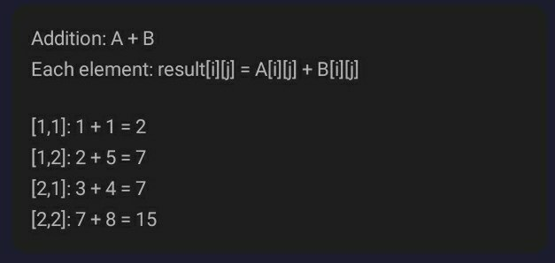
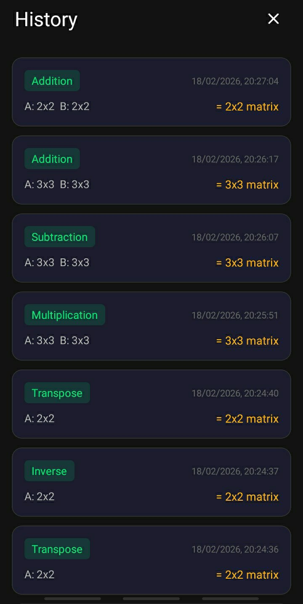

# 🧮 Matrix Solver

  
  

  🚀 Fast, fully offline Android matrix calculator with step-by-step solutions and a clean Material UI.

---

## ✨ Features

  
  
  
  

---

### 🚀 Core Capabilities
- ➕ **Matrix Operations** → Addition, subtraction, multiplication  
- 🔄 **Transpose** → Instantly flip rows & columns  
- 📏 **Determinant & Inverse** → Accurate calculations  

### 📖 Learning Support
- 📝 **Step-by-step solutions** → Perfect for students & learners  
- 🕘 **Local history** → Saved on device, no cloud dependency  
- 🖼️ **Export results as image** → Share or save easily  

### 🎨 User Experience
- 🌈 **Multiple themes** → Customize your look  
- 🔒 **Fully offline** → No internet required, secure & fast  

### 🛡️ Privacy & Security
- 🚫 **No permissions required** → App works without accessing contacts, storage, or network  
- 📂 **Everything stays on your device** → Your data never leaves your phone  
- 🔐 **Safe & private by design** → 100% offline, no tracking, no ads  

---

## 📱 Screenshots

| 🏠 Matrix Input | 📊 Result Screen | 📐 Step-by-Step |
|-----------------|-----------------|----------------|
|  |  |  |

| 🕘 History | 🎨 Themes / Settings | 👤 About |
|------------|---------------------|----------|
|  |  |  |

---
## 📦 Download

📥 From [**Releases**](https://github.com/mkr-infinity/Matrix_Calculator/releases), install:

- 📱 [**arm64-v8a**](https://github.com/mkr-infinity/Matrix_Calculator/releases/download/Matrix_Solver/Matrix_Solver-arm64-v8a-release.apk) → Recommended for modern phones ✅  
- 📱 [**armeabi-v7a**](https://github.com/mkr-infinity/Matrix_Calculator/releases/download/Matrix_Solver/Matrix_Solver-armeabi-v7a-release.apk) → Old / low-end devices  
- 💻 [**x86 / x86_64**](https://github.com/mkr-infinity/Matrix_Calculator/releases/download/Matrix_Solver/Matrix_Solver-x86-release.apk) → Emulator

  
- 🌍 [**universal**](https://github.com/mkr-infinity/Matrix_Calculator/releases/download/Matrix_Solver/Matrix_Solver-universal-release.apk) → Works on all devices  

---

## 🚀 Install

1. ⬇️ Download APK  
2. 📂 Open APK  
3. ⚙️ Allow unknown apps  
4. ✅ Install  

---

## 🛠 Tech Stack

  
  
  

---

## 👨‍💻 Developer

**Mohammad Kaif Raja 🇮🇳**

📸 [Instagram](https://instagram.com/mkr_infinity)  
💬 [Telegram](https://t.me/mkr_infinity)  

---

## ©️ Copyright

- © 2026 **Mohammad Kaif Raja 🇮🇳**  
- 📜 Licensed under **MIT License** → Free to use, modify, and distribute.  
- 🌍 **Open Source** → Anyone can contribute, fork, or improve this project.  
- 🙏 **Credits Required** → Please give proper credit when using or modifying this project.  
- 🤝 **Community Friendly** → Contributions and pull requests are welcome!  

 
---

  ⭐ Star this repo if you like the project!  
    
  

